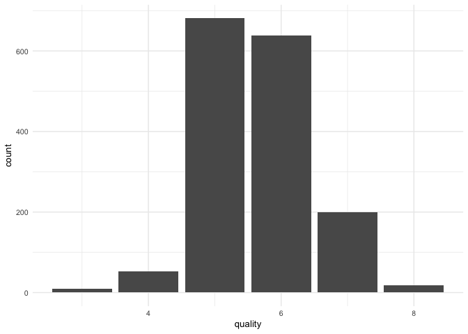
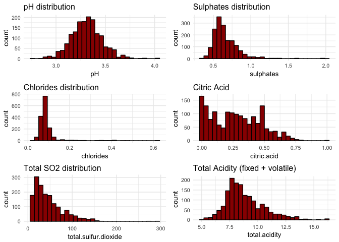
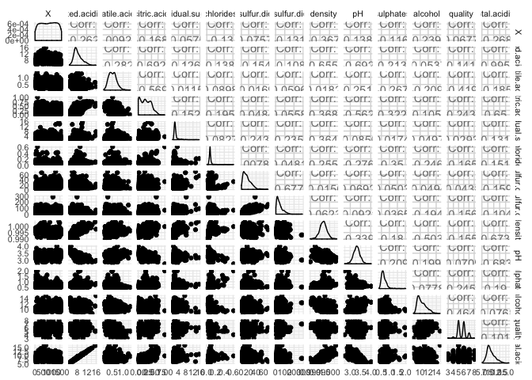
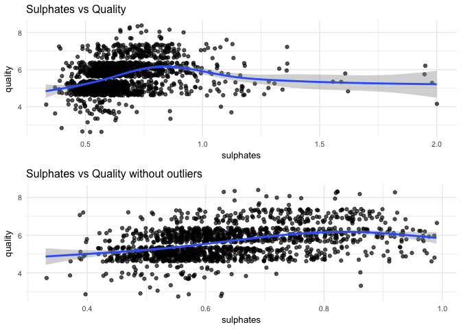
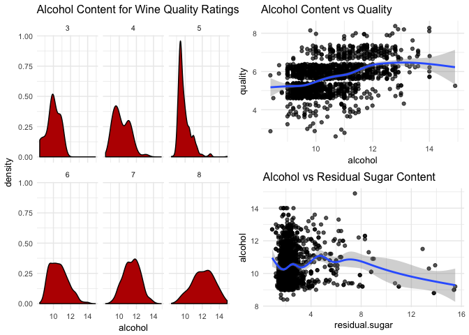
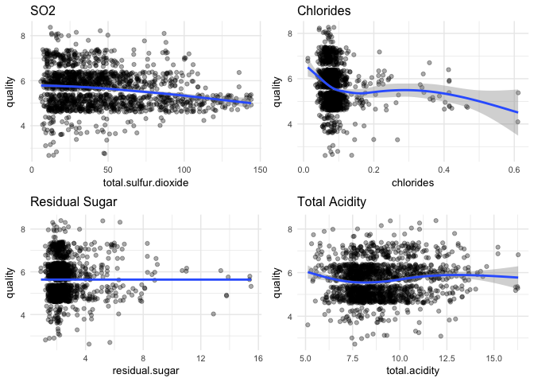
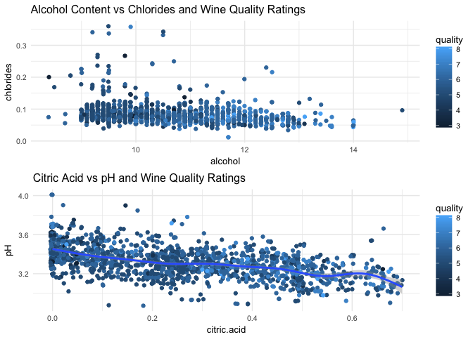
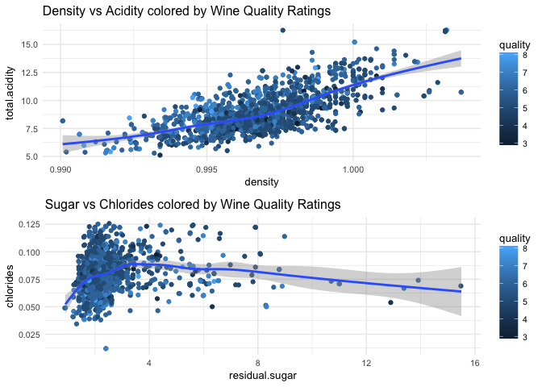
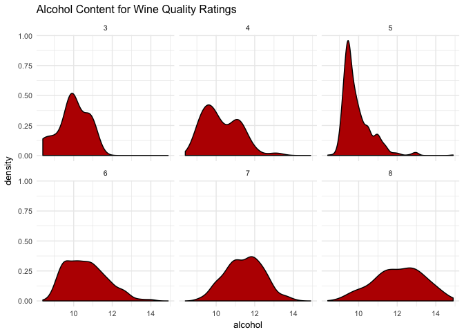
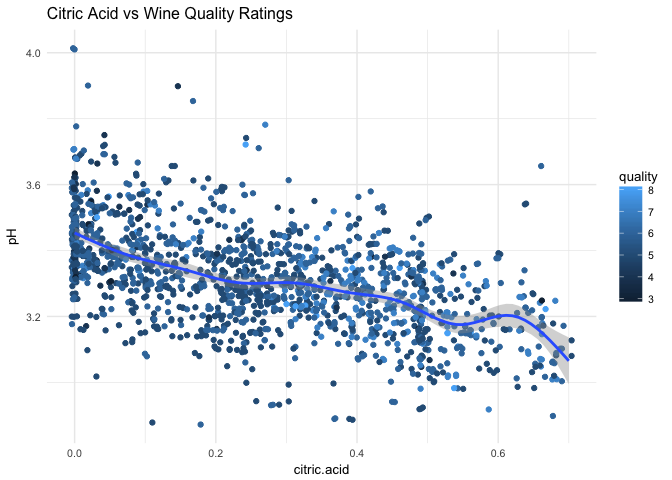

Vines and Wines by Zach Dischner
================================

**Date:** April 4 2017 Part of the Udacity Data Analyst Nanodegree program


### Dataset Description

This investigaion is about red wine. It will analyze red wine properties in order to correlate chemical components to overall wine quality.

**Data Structure**

    ## 'data.frame':    1599 obs. of  14 variables:
    ##  $ X                   : int  1 2 3 4 5 6 7 8 9 10 ...
    ##  $ fixed.acidity       : num  7.4 7.8 7.8 11.2 7.4 7.4 7.9 7.3 7.8 7.5 ...
    ##  $ volatile.acidity    : num  0.7 0.88 0.76 0.28 0.7 0.66 0.6 0.65 0.58 0.5 ...
    ##  $ citric.acid         : num  0 0 0.04 0.56 0 0 0.06 0 0.02 0.36 ...
    ##  $ residual.sugar      : num  1.9 2.6 2.3 1.9 1.9 1.8 1.6 1.2 2 6.1 ...
    ##  $ chlorides           : num  0.076 0.098 0.092 0.075 0.076 0.075 0.069 0.065 0.073 0.071 ...
    ##  $ free.sulfur.dioxide : num  11 25 15 17 11 13 15 15 9 17 ...
    ##  $ total.sulfur.dioxide: num  34 67 54 60 34 40 59 21 18 102 ...
    ##  $ density             : num  0.998 0.997 0.997 0.998 0.998 ...
    ##  $ pH                  : num  3.51 3.2 3.26 3.16 3.51 3.51 3.3 3.39 3.36 3.35 ...
    ##  $ sulphates           : num  0.56 0.68 0.65 0.58 0.56 0.56 0.46 0.47 0.57 0.8 ...
    ##  $ alcohol             : num  9.4 9.8 9.8 9.8 9.4 9.4 9.4 10 9.5 10.5 ...
    ##  $ quality             : int  5 5 5 6 5 5 5 7 7 5 ...
    ##  $ total.acidity       : num  8.1 8.68 8.56 11.48 8.1 ...

**Data Summary**

    ##        X          fixed.acidity   volatile.acidity  citric.acid   
    ##  Min.   :   1.0   Min.   : 4.60   Min.   :0.1200   Min.   :0.000  
    ##  1st Qu.: 400.5   1st Qu.: 7.10   1st Qu.:0.3900   1st Qu.:0.090  
    ##  Median : 800.0   Median : 7.90   Median :0.5200   Median :0.260  
    ##  Mean   : 800.0   Mean   : 8.32   Mean   :0.5278   Mean   :0.271  
    ##  3rd Qu.:1199.5   3rd Qu.: 9.20   3rd Qu.:0.6400   3rd Qu.:0.420  
    ##  Max.   :1599.0   Max.   :15.90   Max.   :1.5800   Max.   :1.000  
    ##  residual.sugar     chlorides       free.sulfur.dioxide
    ##  Min.   : 0.900   Min.   :0.01200   Min.   : 1.00      
    ##  1st Qu.: 1.900   1st Qu.:0.07000   1st Qu.: 7.00      
    ##  Median : 2.200   Median :0.07900   Median :14.00      
    ##  Mean   : 2.539   Mean   :0.08747   Mean   :15.87      
    ##  3rd Qu.: 2.600   3rd Qu.:0.09000   3rd Qu.:21.00      
    ##  Max.   :15.500   Max.   :0.61100   Max.   :72.00      
    ##  total.sulfur.dioxide    density             pH          sulphates     
    ##  Min.   :  6.00       Min.   :0.9901   Min.   :2.740   Min.   :0.3300  
    ##  1st Qu.: 22.00       1st Qu.:0.9956   1st Qu.:3.210   1st Qu.:0.5500  
    ##  Median : 38.00       Median :0.9968   Median :3.310   Median :0.6200  
    ##  Mean   : 46.47       Mean   :0.9967   Mean   :3.311   Mean   :0.6581  
    ##  3rd Qu.: 62.00       3rd Qu.:0.9978   3rd Qu.:3.400   3rd Qu.:0.7300  
    ##  Max.   :289.00       Max.   :1.0037   Max.   :4.010   Max.   :2.0000  
    ##     alcohol         quality      total.acidity   
    ##  Min.   : 8.40   Min.   :3.000   Min.   : 5.120  
    ##  1st Qu.: 9.50   1st Qu.:5.000   1st Qu.: 7.680  
    ##  Median :10.20   Median :6.000   Median : 8.445  
    ##  Mean   :10.42   Mean   :5.636   Mean   : 8.847  
    ##  3rd Qu.:11.10   3rd Qu.:6.000   3rd Qu.: 9.740  
    ##  Max.   :14.90   Max.   :8.000   Max.   :16.285

Observations of Summary Data:

-   There are 1599 samples of Red Wine properties and quality values
-   No wine achieves either a terrible (0) or perfect (10) quality score
-   Residual Sugar measurement has a maximum that is nearly 19 times farther away
    from the 3rd quartile than the 3rd quartile is from the 1st.
-   Citric Acid had a minimum of 0.0. No other property values was exactly 0.

Univariate Plots Section
========================

Overall distribution of *quality* rating of red wines. Quality here is a single measurement between 1 and 10 of oerall wine quality, as decided by three separate agencies



Overall wine quality, rated on a scale from 1 to 10, has a normal shape and very few exceptionally high or low quality ratings.



**Observations of Univariate Properties:**

-   pH distribution is roughly normal centered around 3.3 with tails at 3.0 and
    3.6
-   Sulphates look fairly normal centered at 0.6 +- 0.3, but with a positive skew
    that has measurements all the way out to 2.0
-   Chlorides show a similar behavior with a center around 0.075
-   Citric acid looks nearly like a double ramp function, with a peak at 0.0 and
    nearly constantly decreasing values until another peak citric acid value at
    0.25. A third jump at 0.5 is notable as well.
-   Total acidity is roughly normal with a center at 7.5 and bounds at approx 5.0
    and 15.0.

Of all single component distributions, `pH` appears to be the only measurement that is normally distributed. `Acidity` is next, being normal with just a slight positive skew. `Citric Acid` and `S02` particularly exhibit a strong positive skew. `pH` and `Acidity` reflect measurements that are centered around non-zero numbers, whereas the other measurements are clustered at near-zero numbers. Since these measurements cannot have negative values, the skewed distribution is sensible.

**Note on Acidity** Wine acidity is measured in multiple components: volatile and static. Total acidity is not to be confused with the `pH` of a wine. The former details the amount of acid in the wine, the latter relates to the *strength* of the acids.

More on *static* and *volatile* acidity measures here: <http://winemakersacademy.com/understanding-wine-acidity/>

Univariate Analysis
===================

#### Overview

The red wine dataset features 1599 separate observations, each for a different red wine sample. For each sample, 11 *laboratory* based measurements were made, as well as a single subjective overall quality rating. The quality of a wine was decided upon by three separate professional wine assessment institutions.

As presented, each wine sample is provided as a single row in the dataset. Due to the nature of how some measurements are gathered, some values given represent *components* of a measurement total. For example, `data.fixed.acidity` and `data.volatile.acidity` are both obtained via separate measurement techniques, and must be summed to indicate the total acidity present in a wine sample. For these cases, I supplimented the data given by computing the total and storing in the dataframe with a `data.total.*` variable.

#### Features of Interest

The main interesting measurement here is the wine `quality`. It is the subjective measurement of how attractive the wine might be to a consumer. The goal here will be to try and correlate non-subjective wine properties with its quality.

I am curious about a few trends in particular:

-   sulphates vs quality - Low sulphate wine has a reputation for not causing
    hangovers
-   alcohol vs quality - Just an interesting measurement. Strong beers are
    typically higher quality and harder to make than lower proof beers.

At first, the lack of an age metric might be surprising since it is commonly a factor in quick assumptions of wine quality. However, since the actual effect of wine age is on the wine's measurable chemical properties, its inclusion here is not necessary.

### Distributions

I left distributions alone here. Many measurements that were clustered close to zero had a positive skew (you can't have negative percentages or ammounts). Others such as `pH` and `total.acidity` and `quality` had normal looking distributions.

Bivariate Plots Section
=======================

Scatterplot Matrix
------------------



**Observations of Correlation Plot Matrix**

-   Total Acidity is highly correlatable with fixed acidity
-   pH appears correlatable with acidity, citric acid, chlorides, and residual
    sugars
-   No single property appears to have a correlation with quality

Sulphates
---------

``` r
q1 <- ggplot(aes(x=sulphates, y=quality), data=data) +
  geom_jitter(alpha=2/3) +
  geom_smooth() +
  ggtitle("Sulphates vs Quality")

q2 <- ggplot(aes(x=sulphates, y=quality), data=subset(data, data$sulphates < 1)) +
  geom_jitter(alpha=2/3) +
  geom_smooth() +
  ggtitle("Sulphates vs Quality without outliers")


grid.arrange(q1,q2, ncol=1)
```



**Observations**:

-   There is a slight trend implying a relationship between sulphates and wine
    qualtity, particularly if you disregard extreme sulphate values
-   Disregarding measurements where sulphates &gt; 1.0 is the same as disregarding
    the positive tail of the distribution, keeping just the normal-looking portion
-   The relationship is still a week wone

Alcohol
-------

``` r
q0 <- ggplot(aes(x=alcohol, y=quality), data=data) + 
  geom_jitter(alpha=2/3) + 
  geom_smooth() + 
  ggtitle("Alcohol Content vs Quality")

q1 <- ggplot(aes(x=alcohol), data=data) + 
  geom_density(fill=I("#BB0000")) + 
  facet_wrap("quality") + 
  ggtitle("Alcohol Content for Wine Quality Ratings")

q2 <- ggplot(aes(x=residual.sugar, y=alcohol), data=data) +
  geom_point(alpha=2/3) + 
  geom_smooth() +
  ggtitle("Alcohol vs Residual Sugar Content")

grid.arrange(q1, arrangeGrob(q0, q2), ncol = 2)
```



**Observations**

-   Alcohol and quality appear to be somewha correlatable
-   Lower quality wines tended to have lower alcohol contents
-   Higher quality wines tended to have progressively higher alcohol content
-   There is no/an erratic relation between sugar and alcohol content, which I
    found surprising as alcohol is a byproduct of the yeast feeding off of sugar
    during the fermentation process

SO2, Chlorides, Sugar, and Density
----------------------------------

``` r
q1 <- ggplot(aes(x=total.sulfur.dioxide, y=quality), 
       data=subset(data, data$total.sulfur.dioxide < 
                     quantile(total.sulfur.dioxide, 0.99))) + 
  geom_jitter(alpha=1/3) +
  geom_smooth() + ggtitle("SO2")

q2 <- ggplot(aes(x=chlorides, y=quality),data=data) + 
  geom_jitter(alpha=1/3) +
  geom_smooth() + ggtitle("Chlorides")

q3 <- ggplot(aes(x=residual.sugar, y=quality),data=data) + 
  geom_jitter(alpha=1/3) +
  geom_smooth() + ggtitle("Residual Sugar")

q4 <- ggplot(aes(x=total.acidity, y=quality),data=data) + 
  geom_jitter(alpha=1/3) +
  geom_smooth() + ggtitle("Total Acidity")

grid.arrange(q1,q2, q3, q4)
```



**Observations**

-   There is little to no noticeable correlation between S02 and wine quality
-   Residual Sugar has a particularly weak correlation with wine quality
-   Acidity has no noticeable correlation with wine quality. This
    surprised me more than any other trend

Bivariate Analysis
==================

### Strong Correlations

I did not find a single, obvious and strong correlation between any wine property and the given quality. Alcohol content is a strong contender but even so, the correlation wasn't particularly strong.

### Notables

Most properties have roughly normal distributions, with some skew in one tail. Scatterplot relationships between these properties often showed a slight trend within the bulk of property values. However, as soon as the we leave the *expected range*, the trends actually reverse. See Alcohol Content or Sulphate vs Quality for examples. The trend isn't a definitive one, but it is seen in different variables. Possibly, obtaining an *outlier* property (say sulphate content) is particularly difficult to do in the wine making process. Or, the wines that exhibit outlier properties are deliberatly of a non-standard variety. In that case, it could be that wine judges have a harder time agreeing on a quality rating

Multivariate Plots Section
==========================



**Observtions**

-   Adding chlorides to the Alcohol vs Quality added little insight to the plot
-   Unusually bright chloride points occured at different qualities and alcohol
    content points with no discernable pattern
-   Higher alcohol content and lower chloride content appears to correlate to
    higher quality wines
-   Higher alcohol content and higher citric acid content appears to correlate to
    higher quality wines
-   pH has no notable effect on wine quality



**Observations**

-   Higher quality wines appear to have a slight correlation with higher acidity
    across all densities
-   There are abnormally high and low quality wines coincident with higher-than
    -usual sugar content.

### Model Creation

``` r
m1 <- lm((quality ~ alcohol), data = data)
m2 <- update(m1, ~ . + citric.acid)
m3 <- update(m2, ~ . + chlorides)
m4 <- update(m3, ~ . + residual.sugar)
m5 <- update(m4, ~ . + total.acidity)
mtable(m1, m2, m3, m4, m5)
```

    ## 
    ## Calls:
    ## m1: lm(formula = (quality ~ alcohol), data = data)
    ## m2: lm(formula = quality ~ alcohol + citric.acid, data = data)
    ## m3: lm(formula = quality ~ alcohol + citric.acid + chlorides, data = data)
    ## m4: lm(formula = quality ~ alcohol + citric.acid + chlorides + residual.sugar, 
    ##     data = data)
    ## m5: lm(formula = quality ~ alcohol + citric.acid + chlorides + residual.sugar + 
    ##     total.acidity, data = data)
    ## 
    ## =========================================================================
    ##                      m1         m2         m3         m4         m5      
    ## -------------------------------------------------------------------------
    ##   (Intercept)      1.875***   1.830***   2.056***   2.085***   2.000***  
    ##                   (0.175)    (0.171)    (0.186)    (0.187)    (0.233)    
    ##   alcohol          0.361***   0.346***   0.333***   0.334***   0.336***  
    ##                   (0.017)    (0.016)    (0.017)    (0.017)    (0.017)    
    ##   citric.acid                 0.730***   0.798***   0.814***   0.767***  
    ##                              (0.090)    (0.092)    (0.093)    (0.121)    
    ##   chlorides                             -1.218**   -1.200**   -1.179**   
    ##                                         (0.389)    (0.390)    (0.391)    
    ##   residual.sugar                                   -0.017     -0.017     
    ##                                                    (0.012)    (0.012)    
    ##   total.acidity                                                0.008     
    ##                                                               (0.013)    
    ## -------------------------------------------------------------------------
    ##   R-squared            0.2        0.3        0.3        0.3        0.3   
    ##   adj. R-squared       0.2        0.3        0.3        0.3        0.3   
    ##   sigma                0.7        0.7        0.7        0.7        0.7   
    ##   F                  468.3      276.6      188.7      142.0      113.6   
    ##   p                    0.0        0.0        0.0        0.0        0.0   
    ##   Log-likelihood   -1721.1    -1688.7    -1683.8    -1682.9    -1682.7   
    ##   Deviance           805.9      773.9      769.2      768.3      768.2   
    ##   AIC               3448.1     3385.4     3377.6     3377.8     3379.5   
    ##   BIC               3464.2     3406.9     3404.5     3410.1     3417.1   
    ##   N                 1599       1599       1599       1599       1599     
    ## =========================================================================

``` r
data$guess=median(data$quality)
m21 <- lm((guess ~ quality), data = data)
m22 <- update(m21, ~ . + alcohol)
m23 <- update(m22, ~ . + chlorides)
mtable(m21, m22, m23)
```

    ## 
    ## Calls:
    ## m21: lm(formula = (guess ~ quality), data = data)
    ## m22: lm(formula = guess ~ quality + alcohol, data = data)
    ## m23: lm(formula = guess ~ quality + alcohol + chlorides, data = data)
    ## 
    ## ===================================================
    ##                      m21        m22        m23     
    ## ---------------------------------------------------
    ##   (Intercept)      6.000***   6.000***   6.000***  
    ##                   (0.000)    (0.000)    (0.000)    
    ##   quality          0.000      0.000      0.000     
    ##                   (0.000)    (0.000)    (0.000)    
    ##   alcohol                     0.000      0.000     
    ##                              (0.000)    (0.000)    
    ##   chlorides                              0.000     
    ##                                         (0.000)    
    ## ---------------------------------------------------
    ##   R-squared             0.5        0.5        0.5  
    ##   adj. R-squared        0.5        0.5        0.5  
    ##   sigma                 0.0        0.0        0.0  
    ##   F                  1592.5      796.0      530.4  
    ##   p                     0.0        0.0        0.0  
    ##   Log-likelihood    50645.6    50645.8    50646.0  
    ##   Deviance              0.0        0.0        0.0  
    ##   AIC             -101285.2  -101283.7  -101281.9  
    ##   BIC             -101269.1  -101262.2  -101255.0  
    ##   N                  1599       1599       1599    
    ## ===================================================

Multivariate Analysis
=====================

The strongest relationship between wine properties and wine quality was that of alcohol, chlorides and citric acid. Typically, pH is considered important when assessing wine quality, however the data does not show an appreciable correlation. In fact, any correlations were week ones. The model built with alcohol, chlorides, citric acid, residual sugar and total acidity featured a low R-squared value of just 0.3. Compared with a model where we just start with a guess of the median wine quality (R-squared of 0.5), the model performs rather poorly.

Often, the tails of property distributions showed a varied relationship with quality. Sometimes, the tails would even reverse trends exhibited by the bulk of the property distribution

I was most surprised that pH and residual sugar had no appreciable effect on wine quality as these are two factors that I personally have heard when sommeliers discuss a wine. ------

Final Plots and Summary
=======================

### Plot One



### Description One

This plot I think paints the most complete picture of the analysis of wine quality with two takeaways.

1.  Alcohol content has *some* effect on wine quality rating
2.  The effect is not a strong one, and even for a given rating, there is
    significant variability

This visualization was especially appealing to me because of the way that you can almost see the distribution shuffle from left to right as wine ratings increase. Again, just showing a general tendancy instead of a strong correlation.

### Plot Two



### Description Two

This plot illustrates that (to my suprise) there was little to no correlation between wine quality and pH. At the same time, there a trend where more highly rated wines (brighter blue) tend to be grouped at higher Citric Acid values. However, the trend is far from definite. There are very highly rated wines at low citric acid values as well as very lowely rated wines at high citric acid values.

In summary, this plot illustrates one of the main themes in wine analys thus far: There *are* observable correlations between wine chemical properties and quality. *However*, in each case, there are outlier ratings that undermine the general relationship.

### Plot Three


### Description Three

After alcohol content, citric acid seemed to have the most promeneant effect on wine quality. There is a specific bump at around 0.25 where the wine quality jumps up a rating. That bump was also present in the univariate distribution plot for citric acid. Is that a feature of certain kinds of wine? Or of wines of a certain age? Possibly, just a "sweet spot" of citric acid content that makes for a higher quality wine? The root cause is unknown but I found the behavior interesting nontheless.

When plotted against wine quality in a scatter plot like this, only citric acid and alcohol displayed a noticeable trend. In each case, the distribution is slightly skewed towards higher citric acid and higher quality.

------------------------------------------------------------------------

Reflection
==========

Overall, I was initially surprised by the seemingly dispersed nature of the wine data. Nothing was immediately correlatable to being an inherant quality of good wines. However, upon reflection, this is a sensible finding. Wine making is still something of a science and an art, and if there was one single property or process that continually yielded high quality wines, the field wouldn't be what it is.

I was surprised to find that alcohol content and citric acid were the most correlatable properties to wine quality. In my mind, sulphates and acidity were what I assumed would be the main correlations.

In the future, I would like to do some research into the wine making process. Some winemakers might actively try for some property values or combinations, and finding those combinations (of 3 or more properties) might be the key to truly predicting wine quality. This investigation was not able to find a strong set of two properties that would consistently be able to predict wine quality with any degree of certainty.

Additionally, having the wine type would be helpful for further analysis. Somalliers might prefer certain types of wines to have different properties and behaviors. For example, a Port (as sweet desert wine) surely is rated differently from a dark and robust abernet Sauvignon, which is rated differently from a bright and fruity Syrah. Without knowing the type of wine, it is entirely possible that we are almost literally comparing apples to oranges and can't find a correlation.

> **Tip**: Here's the final step! Reflect on the exploration you performed and the insights you found. What were some of the struggles that you went through? What went well? What was surprising? Make sure you include an insight into future work that could be done with the dataset.
